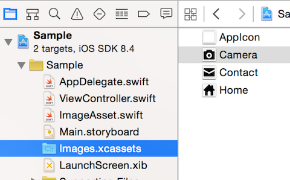

# Misen
Misen is a script to support using Xcode Asset Catalog in Swift.  

# Features
Misen scans sub-directories in the specified Asset Catalog and creates a UIImage extension file which has the following features.
- *Application-specific enum* which is constructed from Asset Catalog names and UIImage object can be instantiated directly from it.
- *UIImage non-failable initializer* whose argument is an enum value above.

# Usage
- Change file permissions first.

```
chmod +x misen.swift
```
- Run the script.
```
./misen.swift -path PATH/TO/XCASSETS -exportPath PATH/TO/GENERATED_FILE -enumName ENUM_NAME
```
 - ```-path``` is a path of the asset catalog.
 - ```-exportPath``` is an output UIImage extension file path.
 - ```-enumName``` is an enum name to be generated. This is **optional** and ```ImageAsset``` is used as default when this parameter is not specified.


#### e.g.
Misen generates the file below from the asset catalog with 3 image sets below.
For reference, see the [**script**](Sample/generate.sh) of the sample project.



```swift
import UIKit

// MARK: - UIImage extension
extension UIImage {
    convenience init!(assetName: ImageAsset) {
        self.init(named: assetName.rawValue)
    }
}

// MARK: - ImageAsset
enum ImageAsset: String {
    case Camera = "Camera"
    case Contact = "Contact"
    case Home = "Home"

    var image: UIImage {
        return UIImage(named: self.rawValue)!
    }
}
```

- In your code, you can instantiate images in Asset Catalog as follows.

```
class ViewController: UIViewController {

    @IBOutlet weak var cameraImageView: UIImageView! {
        didSet {
            // Instantiate UIImage directly from ImageAsset enum
            cameraImageView.image = ImageAsset.Camera.image
        }
    }

    @IBOutlet weak var contactImageView: UIImageView! {
        didSet {
            contactImageView.image = ImageAsset.Contact.image
        }
    }

    @IBOutlet weak var homeImageView: UIImageView! {
        didSet {
            // Instantiate UIImage with UIImage extension
            homeImageView.image = UIImage(assetName: .Home)
        }
    }
    ...
}
```

# Requirements
- Xcode 6.4
- Swift 1.2

# Release Notes
See [CHANES.md](CHANGES.md).

# License
Misen is released under the MIT license. See LICENSE for details.
