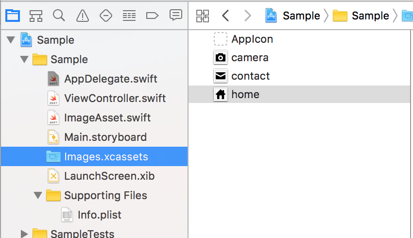

# Misen
Misen is a script to support using Xcode Asset Catalog in Swift.  

# Features
Misen scans sub-directories in the specified Asset Catalog and creates a UIImage extension file which has the following features.
- Application-specific enums which is constructed from Asset Catalog names.
- UIImage non-failable initializer whose argument is an enum value above.

#### e.g.
Misen creates the UIImage extension file from the asset catalog with 3 image sets below.



```
extension UIImage {

    convenience init!(assetName: AssetName) {
        self.init(named: assetName.rawValue)
    }

    enum AssetName: String {
        case Camera = "Camera"
        case Home = "Home"
        case Mail = "Mail"
    }
}
```

- In your code, you can instantiate images in Asset Catalog as follows.

```
let camera = UIImage(assetName: .Camera)
let home   = UIImage(assetName: .Home)
let mail   = UIImage(assetName: .Mail)
```


# Usage
- Change file permissions first.

```
chmod +x misen.swift
```
- Run the script.
 - ```-path``` is a path of the asset catalog.
 - ```-exportPath``` is an output UIImage extension file path.

```
./misen.swift -path PATH -exportPath OUTPUT_FILE_PATH
```

# Requirements
- Xcode 6.3
- Swift 1.2

# License
Misen is released under the MIT license. See LICENSE for details.
